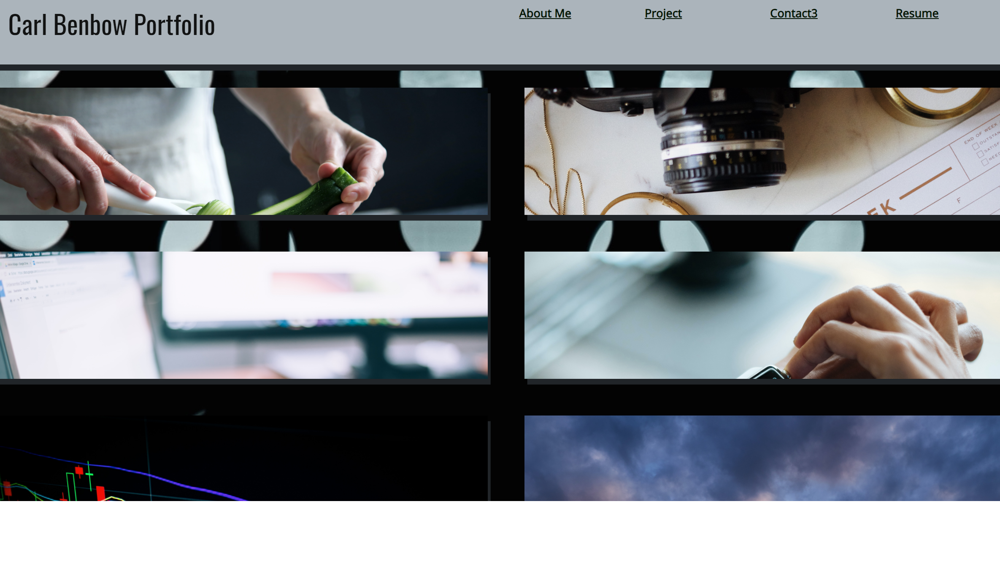

# React Portfolio

## Project Description 
The React Portfolio showcases my John Hopkins Trilogy Bootcamp deployed application for homework and projects Assignments. This profile describes my software engineer competency and proficiencies in the various front and back technologies. 
 

## Table of Content

* [Installation](#installation)

* [Usage](#usage)

* [License](#license)

* [Contribution](#contribution)

* [Credit](#credits)

* [Test](#test)

* [Collaborators](#collaborators) 

## Installation
No steps to install

Below is the URL to the webpage and github repository. 

Website URL: https://synag.github.io/react-portfolio/

Github repository: https://github.com/synag/react-portfolio

## Usage
Limited usage instructions. 

The sreenshot for the iPortfolio App is below. 

## License
The license used for this project is MIT. Here is the license link https://opensource.org/licenses/MIT

## Credits
html, css, js, MERN Stack

## Contribution
No contribution guideline

## Test
No test instructions

## Collaborators  
No Collaborators

Contact team member below if you have any questions: 
* Github username: synag
* Github URL: https://github.com/synag
